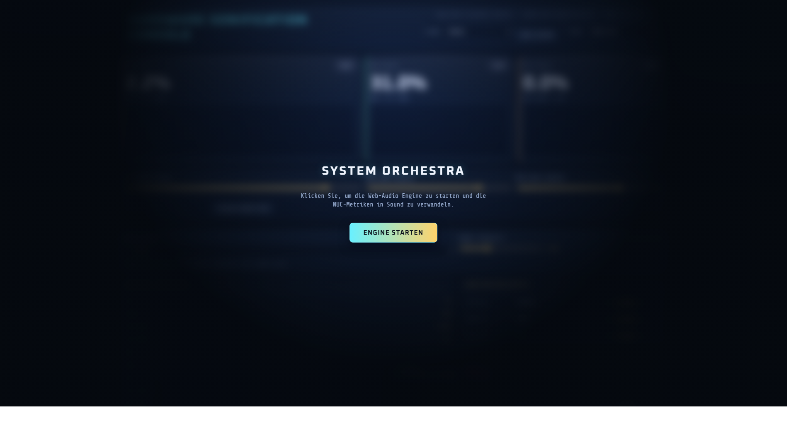

# HSP — Hardware Sonification Pipeline

[](LICENSE)
[](https://github.com/maximilianwruhs-cyber/HSP/actions/workflows/ci.yml)
[](https://www.python.org/)
[](https://ubuntu.com/)
[](https://www.rust-lang.org/)

[](https://github.com/maximilianwruhs-cyber)

> Turn your machine's heartbeat into music.

HSP translates live Linux telemetry — CPU, RAM, GPU, disk I/O, network, power — into a continuous MIDI stream driven by an **adaptive sampling clock** that responds to real workload, not fixed-interval polling.

<p align="center">
  
</p>

## Why This Exists

Fixed-interval polling misrepresents machine state: a loaded system and an idle one are indistinguishable at 1 Hz. HSP derives its sample rate from a live **activity score** (I/O pressure, scheduler signals, metric deltas), so the MIDI output — tempo, pitch, velocity, modulation — is proportional to actual workload.

Two runtimes, one pipeline:

| Runtime | Language | Use Case |
|---|---|---|
| **Production** | Python 3.10+ / FastAPI | Web UI, MIDI engine, full telemetry |
| **Experimental** | Rust (`hsp-rs/`) | Constrained systems < 5 MB RSS |

## Quick Start

### Web Monitor (no audio hardware needed)

```bash
git clone https://github.com/maximilianwruhs-cyber/HSP.git && cd HSP
./run_web.sh           # bootstraps venv, starts server on http://localhost:8001/
```

### Live MIDI Output

```bash
sudo apt install -y fluidsynth fluid-soundfont-gm libportaudio2 portaudio19-dev
./run_live.sh          # starts FluidSynth daemon + live MIDI mode
```

### Web + MIDI Combined

```bash
ENABLE_MIDI=1 ./run_web.sh
```

That's it — one command gets you running.

## Telemetry Coverage

HSP monitors **20+ system signals** in real time:

| Domain | Signals |
|---|---|
| **CPU** | Usage %, frequency, temperature, load average, iowait, context switches, interrupts |
| **Memory** | RAM %, swap % |
| **GPU** | Utilization, temperature, power draw, VRAM (NVIDIA, AMD ROCm, Intel, generic hwmon) |
| **Disk** | Throughput (B/s), IOPS, busy %, storage temperature |
| **Network** | Throughput (B/s), packets/s, errors/s, drops/s |
| **Power** | RAPL package power, battery draw |

## Architecture

```
┌─────────────────────────────────────────────────────┐
│                    Web UI (index.html)               │
│          Real-time telemetry dashboard               │
└───────────────────────┬─────────────────────────────┘
                        │ WebSocket
┌───────────────────────┴─────────────────────────────┐
│              FastAPI / uvicorn (async)                │
│  ┌──────────┐  ┌──────────┐  ┌───────────────────┐  │
│  │ /health  │  │  /state  │  │   /ws (observer)  │  │
│  │ /control │  │ /ingest  │  │   /ws?role=ctrl   │  │
│  └──────────┘  └──────────┘  └───────────────────┘  │
│                       │                              │
│  ┌────────────────────┴──────────────────────────┐   │
│  │         NaturalSamplingClock                  │   │
│  │   Adaptive rate from activity score           │   │
│  │   (I/O pressure + scheduler + metric deltas)  │   │
│  └────────────────────┬──────────────────────────┘   │
│                       │                              │
│  ┌────────────────────┴──────────────────────────┐   │
│  │    Telemetry Layer (psutil + /proc + hwmon)   │   │
│  │    GPU Detector (nvidia-smi / rocm-smi /      │   │
│  │                   intel_gpu_top / sysfs)       │   │
│  └────────────────────┬──────────────────────────┘   │
│                       │                              │
│  ┌────────────────────┴──────────────────────────┐   │
│  │   MIDI Engine (mido + python-rtmidi + ALSA)   │   │
│  │   → FluidSynth (SF2 synthesis)                │   │
│  └───────────────────────────────────────────────┘   │
└──────────────────────────────────────────────────────┘
```

### Stack

| Layer | Technology |
|---|---|
| **Web** | FastAPI + uvicorn — async HTTP/WS broker, zero-copy frame fan-out |
| **Telemetry** | psutil + `/proc` + hwmon + RAPL — no external daemon required |
| **MIDI** | mido + python-rtmidi — ALSA sequencer backend |
| **Synthesis** | FluidSynth — SF2 software synth with auto backend probing |
| **Rust** | epoll + timerfd — zero-async single-threaded runtime, midir for MIDI |

## HTTP / WebSocket API

| Method | Path | Description |
|---|---|---|
| `GET` | `/` | Embedded web UI |
| `GET` | `/health` | `{"ok":true}` liveness check |
| `GET` | `/state` | Current telemetry snapshot (JSON) |
| `POST` | `/control` | Apply `escalation_regulator`, `metrics_source`, or `experience_profile` |
| `WS` | `/ws` | Observer stream (seq-gated JSON frames) |
| `WS` | `/ws?role=control` | Idempotent control channel with `control_ack` / `control_error` |
| `WS` | `/ingest` | External telemetry push; responds `ingest_ack` |

Control payload: JSON object with `command_id` (string) and at least one mutable field. Duplicate `command_id` values are deduplicated.

## Configuration

| Variable | Default | Description |
|---|---|---|
| `ESCALATION_REGULATOR` | `1.0` | Musical intensity scalar [0.35–2.5] |
| `AUDIO_DRIVER` | `portaudio` | FluidSynth audio backend (auto-fallback) |
| `AUDIO_BUFSIZE` | `64` | FluidSynth buffer size for latency tuning |
| `MIDI_DRIVER` | `alsa_seq` | FluidSynth MIDI backend |
| `SOUNDFONT` | `/usr/share/sounds/sf2/FluidR3_GM.sf2` | SF2 soundfont path |
| `MIDI_HINT` | `FLUID` | Substring to select MIDI output port |
| `HSP_WS_TOKEN` | *(empty)* | Bearer token for WebSocket connections |
| `HSP_INGEST_TOKEN` | `$HSP_WS_TOKEN` | Token for the ingest role |
| `ENABLE_MIDI` | `0` | Set `1` to enable MIDI output in web mode |
| `METRICS_SOURCE` | `local` | `local` or `external` (ingest overlay) |

```bash
HSP_WS_TOKEN=change-me ESCALATION_REGULATOR=1.5 ./run_web.sh
```

## External Telemetry Sources

### Telegraf

```bash
METRICS_SOURCE=external ./run_web.sh
telegraf --config ./telegraf_hsp.conf   # second terminal
```

### Netdata Bridge

```bash
./run_netdata_bridge.sh
```

Both feed telemetry into `ws://localhost:8001/ingest`. If external frames stop, HSP falls back to local `/proc` sampling automatically.

## Rust Runtime

```bash
cd hsp-rs && cargo test
cargo run -- --live --host 127.0.0.1 --port 18001 --midi-port-hint FLUID
```

Exposes the same HTTP+WS API on port `18001`. Targets < 5 MB RSS with no Tokio dependency.

## systemd Integration

```bash
./install_systemd_user_services.sh
systemctl --user enable --now hsp-web-local.service
journalctl --user -u hsp-web-local.service -f
```

Available units: `hsp-web-local`, `hsp-web-external`, `hsp-telegraf`, `hsp-netdata-bridge`.

## Testing

```bash
# Python (62 tests)
./venv/bin/python -m unittest discover -q

# Rust (21 tests)
cd hsp-rs && cargo test

# MIDI smoke check
python scripts/midi_smoke.py          # no hardware required
python scripts/midi_smoke.py --strict # requires MIDI endpoint
```

## Security

- `HSP_WS_TOKEN` / `HSP_INGEST_TOKEN` gate all WebSocket connections. Leave empty only on `127.0.0.1`.
- `.gitignore` blocks `.env`, `*.log`, `venv/`, and `target/`. Never commit credentials.
- Dependency scanning: `pip-audit` (Python), `cargo audit` (Rust).
- GPU metrics are optional — the pipeline continues without them.

---

## AgenticOS Ecosystem

| Project | Description |
|---------|-------------|
| [**AOS**](https://github.com/maximilianwruhs-cyber/AOS) | Sovereign AI layer for Ubuntu — the brain of the ecosystem |
| [**AOS Customer Edition**](https://github.com/maximilianwruhs-cyber/AOS-Customer-Edition) | Zero-touch deployment — one `curl` command installs everything |
| [**AOS Intelligence Dashboard**](https://github.com/maximilianwruhs-cyber/AOS-Intelligence-Dashboard) | VS Codium extension for real-time energy monitoring & LLM leaderboard |
| [**Obolus**](https://github.com/maximilianwruhs-cyber/Obolus) | Intelligence per Watt — benchmark which LLM is most efficient on your hardware |
| [**HSP VS Codium Extension**](https://github.com/maximilianwruhs-cyber/HSP-VS-Codium-Extension) | VS Codium sidebar for live HSP telemetry visualization |

## License

MIT — see [LICENSE](LICENSE).
